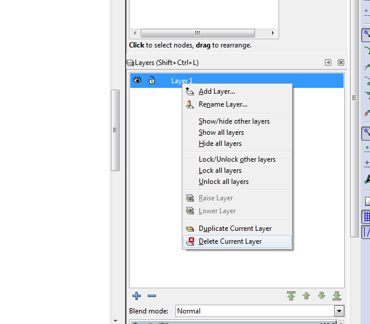
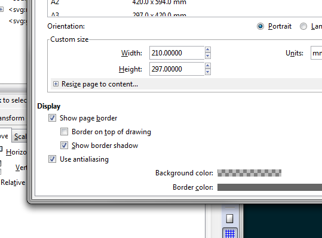

# Using Inkscape with the Hype Framework
If you are trying to use Inkscape with the [Hype Framework](http://www.hypeframework.org/) you
might have noticed that by default it doesn't seem to work correctly.  To get it to work
as if you saved your document from illustrator, you need to delete the default layer in 
Inkscape before you start, convert to paths, and make sure your groups are compound paths.

## Creating the document
* open the layers panel (ctrl-shift-l)
* right click on Layer 1, and select Delete current layer 
* draw all your artwork on as you would normally.
* when you are finished, select everything and convert to path (ctrl-shift-c)
* to create groups of shapes, shift click on each shape you want to add into a group, and then create a compound group (ctrl-k)
* select the entire document, and then open document preferences (ctrl-shift-d), open the "resize page to content" section, and click the "Resize page to drawing or selection" button. 
* save the file in the data folder of the sketch (or drag it onto processing)

## Setup the Hype application
The most important thing in the application is to make sure you are in 2D mode.  If you happen to be in 3d
mode you'll notice that the shapes will be extremely distorted and all over the place.  

```java

import hype.*;
import hype.extended.behavior.*;
import hype.extended.colorist.*;
import hype.extended.layout.*;
import hype.interfaces.*;

HColorPool colors;
HShape d4;

void setup(){
	
	// do not create a p3d or opengl surface or things will
	// no render correctly
	size(640,640);

	H.init(this).background(#202020).use3D(false).autoClear(true);
	smooth();

	colors = new HColorPool(#FFFFFF,#F7F7F7,#ECECEC,#0095A8,#00616F,#333333,#FF3300,#FF6600);

	d4 = new HShape("test.svg");
	H.add(d4);
}

void draw(){
	H.drawStage();

	// saveFrame("frames/#########.tif"); if (frameCount == 900) exit();
}

void keyPressed() {
	d4.randomColors( colors.fillOnly() );
	H.drawStage();
}
```

## Complete example
The svgtest directory contains the complete example of a processing application
using hype with artwork created in inkscape.